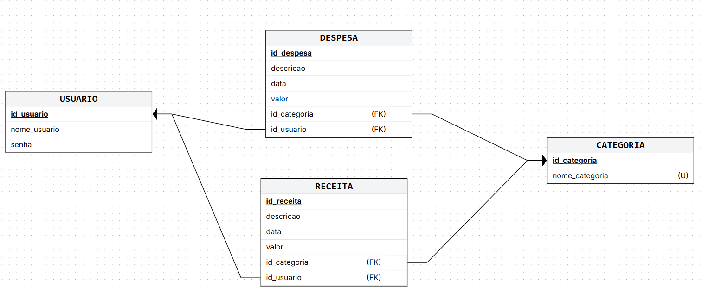

<h1 align="center">FinControl</h1>
<p align="center"><strong>Sistema de gerenciamento financeiro em Python — 🚧 em desenvolvimento ativo</strong></p>

> **Status:** este projeto está em construção. Login, cadastro de receitas e categorias já funcionam; despesas, saldo e histórico ainda estão sendo implementados. Veja a seção [Funcionalidades](#-funcionalidades) para o status detalhado de cada parte.

## 📋 Descrição

Projeto open source para ajudar uma pessoa ou pequena empresa a controlar receitas e despesas de forma simples, via terminal, com persistência em banco de dados SQLite.

Arquitetura em camadas (`models` → `repositories` → `services` → `ui`), separando regra de negócio, acesso a dados e interface — meta do projeto é evoluir de forma organizada, e não só "fazer funcionar".

## ✨ Funcionalidades

**Implementado:**
- ✅ Cadastro e login de usuário
- ✅ Cadastro de receitas, com categoria (inclusive criando categorias novas na hora)
- ✅ Categorias padrão pré-cadastradas (Alimentação, Transporte, Moradia, Saúde, Educação, Lazer, Salário, Investimentos)

**Em desenvolvimento:**
- 🚧 Cadastro de despesas (schema do banco já pronto, lógica em construção)
- 🚧 Cálculo de saldo
- 🚧 Histórico de movimentações
- 🚧 Relatórios
- 🚧 Dashboard

## 🗂️ Arquitetura

```
src/
├── main.py              # ponto de entrada
├── database.py          # conexão e inicialização do SQLite
├── models/               # entidades (Usuario, Receita, Categoria)
├── repositories/         # acesso direto ao banco (SQL)
├── services/              # regras de negócio
├── dto/                    # objetos de transferência de dados
└── ui/                      # menu de linha de comando
```

## 🛠️ Tecnologias

[](https://skillicons.dev)

Python 3 puro + SQLite3 (biblioteca padrão) — sem dependências externas.

## 🗄️ Modelo de dados



Ver detalhes em [`docs/database.md`](docs/database.md).

## ▶️ Como rodar

```bash
git clone https://github.com/LucasFelix-Git/FindControl.git
cd FindControl
python src/main.py
```

Execute a partir da raiz do projeto (o banco é criado automaticamente em `database/fincontrol.db` na primeira execução).

## 🚧 Roadmap

- [x] Cadastro e login de usuário
- [x] Cadastro de receitas
- [ ] Cadastro de despesas
- [ ] Saldo
- [ ] Categorias personalizáveis pelo usuário
- [ ] Relatórios
- [ ] Dashboard

## 📄 Licença

Este projeto está disponível sob a licença [MIT](LICENSE).

## 👤 Autor

**Lucas Felix** — [GitHub](https://github.com/LucasFelix-Git)